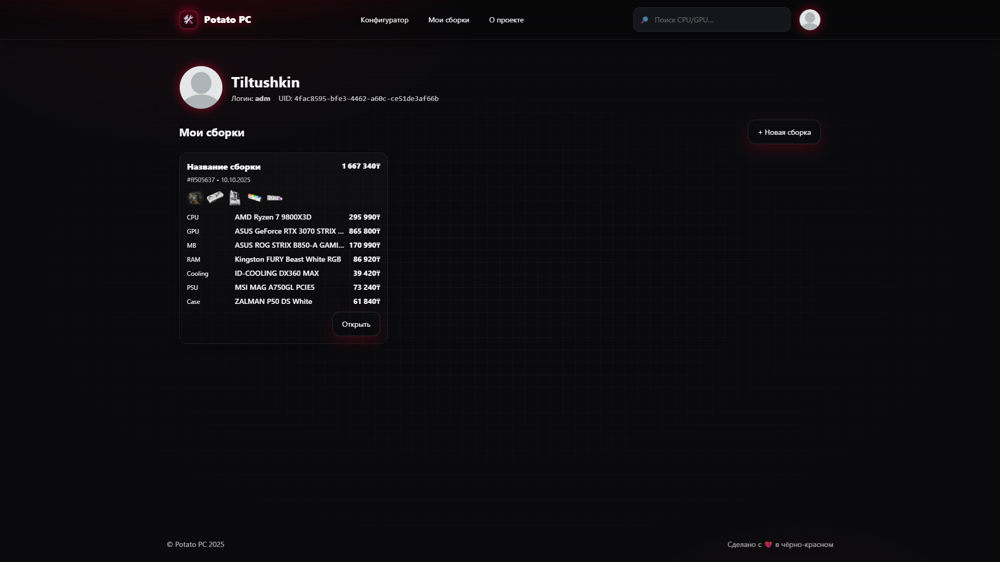
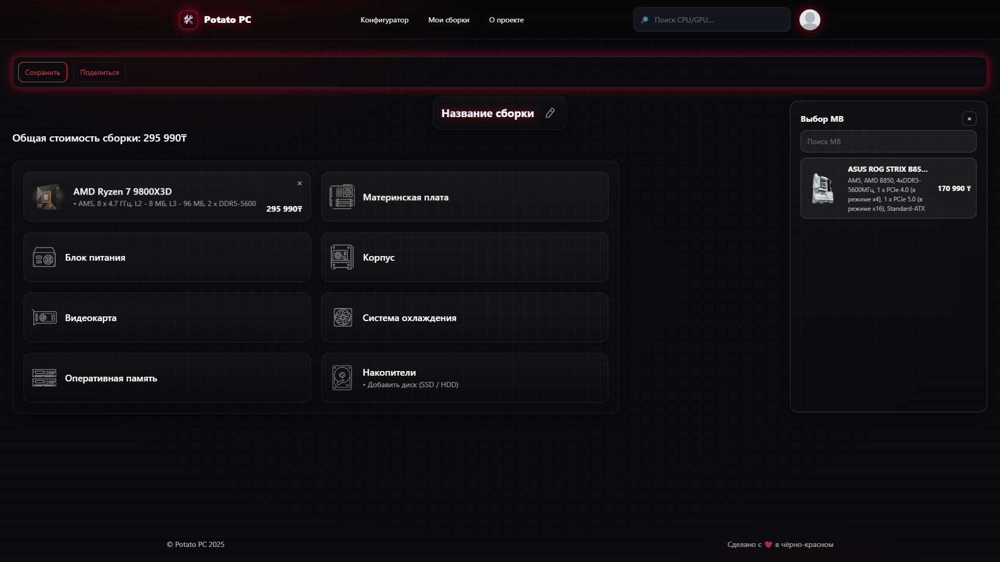
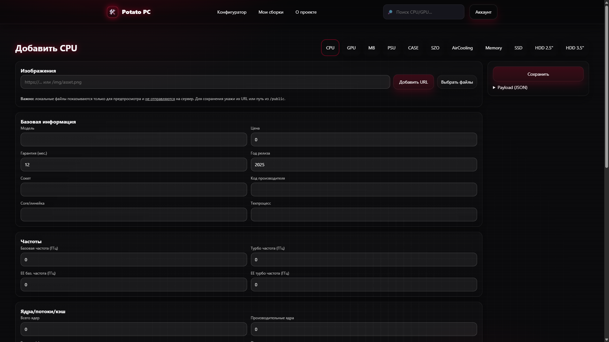

# Как протестировать?
1. Скачать/склонировать репозиторий
2. Выполнить в корне проекта 2 команды в терминале:

- 2.1: ```npm install```
- 2.2: ```npm run dev```

---

## Пет-проект был выполнен с полноценной серверной частью. Найти её можно [`здесь`](https://github.com/Tiltushkin/configurator-api)

---

### Основные зависимости, которые используются в проекте:

- react-redux
- reduxjs toolkit
- framer-motion
- sass-embedded (dev)
- axios
- react-router-dom



